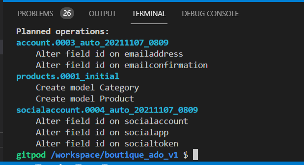
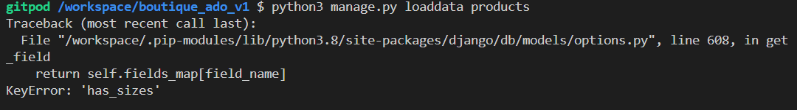
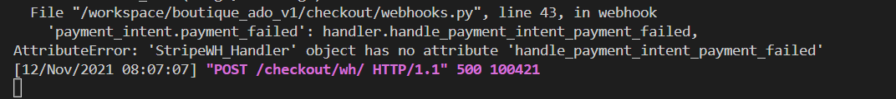
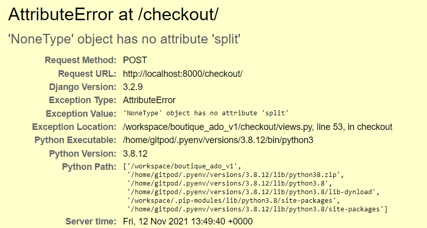
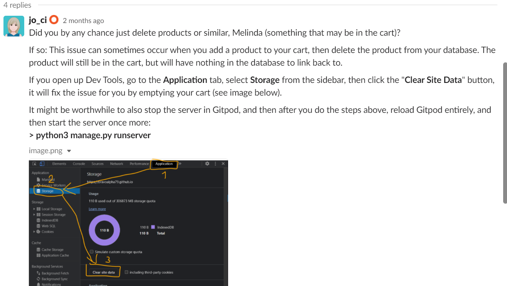
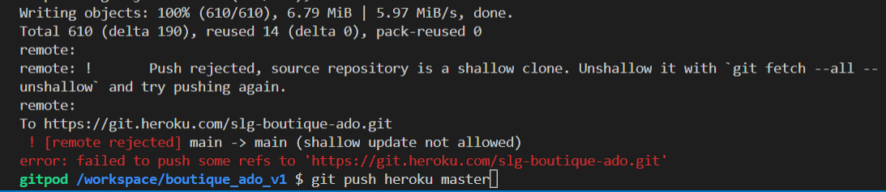

## Bugs and Solutions
1. base.css not found - file was not in css folder - just under it!
2. background image not loading - error in making tuple l157 settings.py - removed COMMA
3. migrations ok I think: 

4. python3 manage.py loaddata : categories ok but products key error has_sizes

Hi @Cairi S I had this issue too. It depends on whether you take the json file from Tim or Chris. Tim's is the one with the sizes and is formatted already and Chris' is the one without sizes and unformatted. I'm not sure why they are different or why Tim's hasn't been either removed or updated, but that is the issue :+1:

download from here(https://github.com/ckz8780/boutique_ado_v1)

4. Mixed up urls home and products when copy pasting so had them reversed

5. Categories badges not displaying below header. For loop not being read at all. No errors in terminal. Used print() statements to see that loop being missed and print  raised an error page. Solved: Was missing  _ in current_categories in views.py

6. Error - bag.html - bag template does not exist in bag/bag.html. Solved forgot to create another bag folder inside bag/templates

7. Template does not exist - twice have created template directly in templates folder with subfolder within templates e.g products

8. Error removing products - POST error Jquery - but was missing import HTTPresponse in bag/views.py

9. Toasts - all showing except the one for empty search field. Also noticed error { block.super } showing on site when searched e.g. zzzzzzzzzz Fixed - found missing {} around block.super --> {{ block.super }}

10. Would not load checkout form but no errors - forgot to add url to href in bag.html. The incorrect syntax of checkout template not found. Corrected syntax but still error until shut server and restarted

11. Authentication error - API key you have not done API key - fix must do the two export commands then runservr commands in same terminal straight after

12 Webhooks test 

fixed in webhooks.py payment_intent_failed should have been payment_intent_payment_failed

13 Stripe 14 - wh bad request
payment went through but wh/bad request - export keys??

14 split?
 - fix export all keys??

15. operational error no such column userprofile Profile App part 5 - fix needed to migrate but I don't think Chris did??

16. country field label appearing in form - fix - lines 33/34 of forms.py (profile) were not indented self.fields etc

17. operational error at bad/add/14 database is locked - just waited - maybe still loading

18. userprofile was not attached by webhook when form commented out. Fix- Had added user profile to while loop instead of try line 91 webhook handler

19. bad header error when trying to send confirmation emails 'header values can't contain new lines' header 'subject' Fix had extra line after content in email_subject.txt

20. EVERYTHING broke when tried to delete test products Finishing adding product functionalilty video. Can't even get into site. Went back to Product form video to retrace steps

21. deployment part 2 

